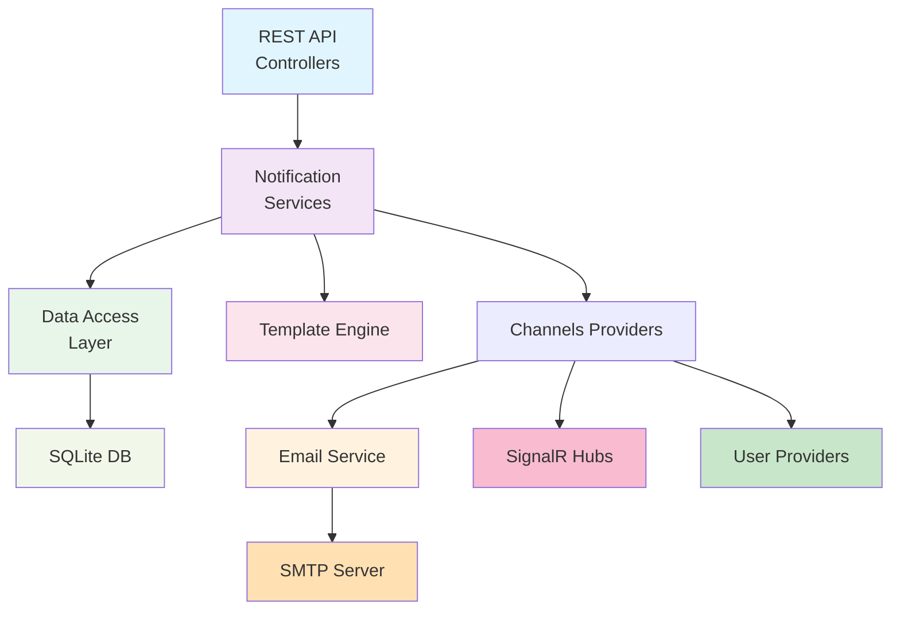

# Generic Notification Service - MVP

A universal, extensible REST API notification service with real-time SignalR support for sending notifications via multiple channels (Email, Database storage, and InApp).

## 🎉 What's New in MVP

This MVP includes:
- ✅ **Generic Notification Handlers** - UserRegistered, OrderCreated, TaskAssigned
- ✅ **SignalR Integration** - Real-time notifications to connected clients
- ✅ **JWT Authentication** - Secure user authentication and authorization
- ✅ **Targeted Notifications** - SignalR notifications delivered only to specific users
- ✅ **Showcase Application** - Full-featured demo with React + TypeScript + MobX + Tailwind
- ✅ **Test Application** - Ready-to-use demo application
- ✅ **InApp Frontend Component** - React/TypeScript notification UI
- ✅ **Removed Docsvision Dependencies** - Now completely generic

## 🚀 Showcase Application (NEW!)

**Complete demonstration application with authentication and real-time targeted notifications!**

> **⚡ Quick Start**: See [QUICKSTART.md](./QUICKSTART.md) for a 2-minute setup guide

### Quick Start - Showcase App

The fastest way to see all features in action:

```bash
cd showcase
./start.sh    # Linux/Mac
start.bat     # Windows
```

Then open http://localhost:3000 in your browser.

**Features:**
- 🔐 User registration and login with JWT authentication
- 📊 Beautiful dashboard with Tailwind CSS
- 🔔 Real-time notification panel
- 📤 Send test notifications (UserRegistered, OrderCreated, TaskAssigned)
- 🎯 **Targeted delivery** - Notifications reach only specific users via SignalR
- 📱 Responsive design for mobile and desktop

**Technology Stack:**
- Backend: .NET 8, JWT, SignalR, SQLite
- Frontend: React 18, TypeScript, MobX, Tailwind CSS, Vite

See [showcase/README.md](./showcase/README.md) for detailed documentation.

## Quick Start

### Backend API

1. **Requirements:** .NET 8 SDK, SQLite (included)

2. **Build and run:**
   ```bash
   cd backend
   dotnet build
   dotnet run --project src/NotificationService.Api
   ```

3. **Access:**
   - API: http://localhost:5093/api
   - Swagger UI: http://localhost:5093/swagger
   - SignalR Hub: http://localhost:5093/notificationHub

### Test Application

The easiest way to test the notification service:

```bash
cd testapp
./start.sh    # Linux/Mac
start.bat     # Windows
```

Then open http://localhost:8080 in your browser.

### Frontend Component

The InApp notification component with SignalR support:

```bash
cd frontend/sed-notifications-frontend
npm install
npm start
```

Access at http://localhost:5094

## SignalR Real-Time Notifications

The service includes SignalR support for real-time notification delivery with **targeted delivery to specific users**.

### Targeted Notifications (NEW!)

Notifications are now delivered only to specific users via SignalR using JWT authentication:

**TypeScript Example with JWT:**
```typescript
import * as signalR from '@microsoft/signalr';

const connection = new signalR.HubConnectionBuilder()
    .withUrl("http://localhost:5093/notificationHub", {
        accessTokenFactory: () => yourJwtToken  // JWT token for authentication
    })
    .withAutomaticReconnect()
    .build();

connection.on("ReceiveNotification", (notification) => {
    console.log("Received targeted notification:", notification);
    // Handle notification in your UI - this will only fire for notifications sent to YOUR user
});

await connection.start();
```

### Broadcast Notifications (Legacy)

For backward compatibility, broadcast to all connected clients is still supported:

**JavaScript Example:**
```javascript
const connection = new signalR.HubConnectionBuilder()
    .withUrl("http://localhost:5093/notificationHub")
    .withAutomaticReconnect()
    .build();

connection.on("ReceiveNotification", (notification) => {
    console.log("Received:", notification);
    // Handle notification in your UI
});

await connection.start();
```

### Events

- `ReceiveNotification` - Fired when a notification is received (targeted or broadcast)

### How Targeted Delivery Works

1. **User Authentication**: Users authenticate via JWT tokens (`/api/auth/login`)
2. **SignalR Connection**: Frontend connects with JWT token
3. **User Mapping**: `UserIdProvider` extracts userId from JWT claims
4. **Targeted Delivery**: Backend sends notifications only to specific users via `Clients.User(userId)`

See the [Showcase Application](./showcase/README.md) for a complete example.

## Configuration
- See `docs/reference/Configuration.md`
- Main parameters: `ConnectionStrings:Notifications` (SQLite), `Email` section (SMTP), `JwtSettings` (Authentication)

## Documentation

Полная документация проекта доступна в разделе [docs/](./docs/README.md):

1. [**Обзор и цели системы**](./docs/01-Overview.md) — назначение, возможности, технологический стек
2. [**Архитектура системы**](./docs/02-Architecture.md) — структура, слои, компоненты, диаграммы
3. [**Ключевые компоненты**](./docs/03-Components.md) — детальное описание всех компонентов
4. [**Справочник API**](./docs/04-API.md) — полная документация REST API и SignalR Hub
5. [**Frontend компоненты**](./docs/05-Frontend.md) — документация React компонентов
6. [**Руководство разработчика**](./docs/06-Development-Guide.md) — добавление новых обработчиков и каналов
7. [**Руководство по интеграции**](./docs/07-Integration-Guide.md) — встраивание в существующие приложения

## Example API Requests

### Create a notification

```bash
POST http://localhost:5093/api/notification
Content-Type: application/json

{
  "route": "UserRegistered",
  "channel": "Email",
  "parameters": {
    "UserId": "00000000-0000-0000-0000-000000000001",
    "WelcomeMessage": "Welcome to our service!"
  }
}
```

### Broadcast a test notification via SignalR

```bash
POST http://localhost:5093/api/notification/broadcast
Content-Type: application/json

{
  "title": "Test Notification",
  "message": "This is a broadcast test",
  "route": "Test"
}
```

### Get notifications by user

```bash
GET http://localhost:5093/api/notification/by-user/{userId}
```

## Available Notification Handlers

### 1. UserRegistered
Sent when a new user registers.

**Parameters:**
- `UserId` (Guid) - User identifier
- `WelcomeMessage` (string, optional) - Custom welcome message

**Example:**
```json
{
  "route": "UserRegistered",
  "channel": "Email",
  "parameters": {
    "UserId": "00000000-0000-0000-0000-000000000001",
    "WelcomeMessage": "Welcome aboard!"
  }
}
```

### 2. OrderCreated
Sent when a new order is placed.

**Parameters:**
- `CustomerId` (Guid) - Customer identifier
- `OrderNumber` (string) - Order number
- `OrderTotal` (decimal) - Total order amount
- `ItemCount` (int) - Number of items

**Example:**
```json
{
  "route": "OrderCreated",
  "channel": "Email",
  "parameters": {
    "CustomerId": "00000000-0000-0000-0000-000000000001",
    "OrderNumber": "ORD-12345",
    "OrderTotal": 299.99,
    "ItemCount": 3
  }
}
```

### 3. TaskAssigned
Sent when a task is assigned to a user.

**Parameters:**
- `AssigneeId` (Guid) - User being assigned the task
- `AssignerId` (Guid) - User assigning the task
- `TaskTitle` (string) - Task title
- `TaskDescription` (string) - Task description
- `Priority` (string) - Task priority
- `DueDate` (DateTime) - Due date

**Example:**
```json
{
  "route": "TaskAssigned",
  "channel": "Email",
  "parameters": {
    "AssigneeId": "00000000-0000-0000-0000-000000000001",
    "AssignerId": "00000000-0000-0000-0000-000000000002",
    "TaskTitle": "Complete project",
    "TaskDescription": "Finish the notification service",
    "Priority": "High",
    "DueDate": "2025-12-31T23:59:59Z"
  }
}
```

## Project Structure

```
notifications-service/
├── backend/                          # Backend .NET service
│   ├── src/
│   │   ├── NotificationService.Api/       # REST API and SignalR hub
│   │   ├── NotificationService.Application/  # Business logic
│   │   ├── NotificationService.Domain/    # Domain models
│   │   ├── NotificationService.Infrastructure/  # Data access
│   │   └── NotificationService.TestHandlers/  # Generic test handlers
│   └── NotificationService.sln
├── frontend/                         # Frontend React component
│   └── sed-notifications-frontend/   # InApp notifications UI
├── testapp/                          # Test application
│   ├── index.html                    # Demo web application
│   ├── start.sh                      # Linux/Mac startup script
│   └── start.bat                     # Windows startup script
├── tests/                            # Unit tests
└── docs/                             # Documentation
```

## Project Goals

### Objectives
Development of a universal, extensible REST API notification service with multiple delivery channels.

### Key Features

#### Notification Handlers
The service supports flexible notification types through an extensible handler system:

Example handlers:

1. **UserRegistered** - Welcome notifications for new users
2. **OrderCreated** - Order confirmation notifications
3. **TaskAssigned** - Task assignment notifications
4. **Custom Handlers** - Easily add new notification types

#### Notification Structure
- Creation date
- Subject/Title
- Category/Route
- Brief description
- Read flag
- Payload for each type
- Real-time delivery via SignalR

#### Delivery Channels
- **Primary:** Email (SMTP)
- **Secondary:** SQLite database storage
- **Real-time:** SignalR for InApp notifications
- **Query:** REST API for retrieving notifications

#### Functional Requirements
- ✅ Flexible addition of new notification types
- ✅ Customizable email templates (Handlebars)
- ✅ Real-time push notifications via SignalR
- ✅ User data from various sources
- ✅ Extensible architecture
- ✅ Generic, reusable handlers

## Architecture

### General Schema



### Main Components

#### 1. Data Models
- `Notification` - base notification model
- `User` - user model
- `NotificationTemplate` - notification templates

#### 2. Services
- `INotificationCommandService` - main notification service
- `IEmailProvider` - email sending service
- `ITemplateService` - template management service
- `ITemplateRenderer` - user data provider

#### 3. Controllers
- `NotificationsController` - notification management
- `UsersController` - user data access

#### 4. Data Providers
- Internal database
- External sources (APIs)

### Technology Stack
- .NET 8
- ASP.NET Core Web API
- Entity Framework Core
- SQLite
- SignalR (real-time communications)
- Handlebars.NET (templating)
- System.Net.Mail (for email)
- React + TypeScript (frontend)
- MobX (state management)
- xUnit (for testing)

## Adding Custom Notification Handlers

To add a new notification handler:

1. Create a new folder in `NotificationService.TestHandlers/Notifications/`
2. Implement `INotificationDataResolver` interface
3. Implement `INotificationRouteConfiguration` interface
4. Create Handlebars template (`.hbs` file)
5. Create template configuration (`template.json`)

**Example structure:**
```
MyNotification/
├── MyNotificationDataResolver.cs    # Data resolver
├── MyNotificationRouteConfig.cs     # Route configuration
├── MyNotification.hbs                # Email template
└── template.json                     # Template metadata
```

See existing handlers in `backend/src/NotificationService.TestHandlers/Notifications/` for examples.

## Frontend Component

The project includes a fully-featured React InApp notification component:
- Location: `frontend/sed-notifications-frontend`
- Technology: React, TypeScript, MobX, SignalR
- Features:
  - Real-time notifications via SignalR
  - Notification center with history
  - Toast/popup alerts
  - Read/unread status
  - Filtering and search

## Example HTML Templates

Templates use Handlebars syntax and support custom helpers.

### User Welcome Template (Simplified)
```html
<!DOCTYPE html>
<html>
<body>
    <h1>Welcome {{UserName}}!</h1>
    <p>{{WelcomeMessage}}</p>
    <p>Registered: {{formatDate RegistrationDate "dd.MM.yyyy"}}</p>
</body>
</html>
```

Full templates are in `backend/src/NotificationService.TestHandlers/Notifications/`.

## Development Principles

### SOLID Principles
- **S** - Each component has a single responsibility
- **O** - Open for extension, closed for modification
- **L** - Substitutability of derived classes
- **I** - Interface segregation by functionality
- **D** - Depend on abstractions, not implementations

### DRY and KISS
- Repeated code extracted into common components
- Simple and clear solutions
- Minimal dependencies

### Modularity
- Each component in a separate file
- Clear separation of concerns
- Easy to test and replace components

## Testing

### Run Backend Tests
```bash
cd backend
dotnet test
```

### Run Frontend Tests
```bash
cd frontend/sed-notifications-frontend
npm test
```

### Manual Testing
Use the test application in `testapp/` for manual end-to-end testing.

## Troubleshooting

### Backend won't start
- Ensure .NET 8 SDK is installed
- Check if port 5093 is available
- Review logs for database migration issues

### SignalR connection fails
- Verify CORS settings in `Program.cs`
- Check that the backend is running
- Ensure correct hub URL in client code

### Emails not sending
- Configure SMTP settings in `appsettings.json`
- Check email provider credentials
- Review logs for SMTP errors

## License

This project is open source. See LICENSE file for details.

## Contributing

1. Fork the repository
2. Create a feature branch
3. Make your changes
4. Submit a pull request

## Next Steps

Future enhancements:
1. Add more notification handlers (SMS, Push, Slack, etc.)
2. Add user preferences for notification channels
3. Add notification scheduling
4. Add notification batching
5. Add analytics and reporting
6. Add notification history API
7. Add webhook support