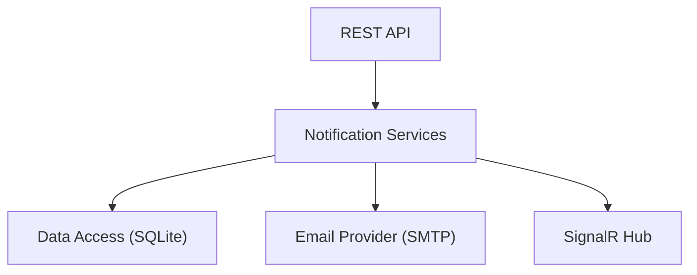

# Generic Notification Service

A universal, extensible REST API notification service with real-time SignalR support for sending notifications via multiple channels (Email, Database storage, and InApp).

## Project Overview

The Notification Service is designed to be a generic, production-ready solution for managing and delivering notifications. It supports various notification types and delivery channels, ensuring that users receive important updates in real-time or via traditional methods like email.

### Key Features

- **Generic Notification Handlers**: Easily extensible system for different notification types (e.g., User Registration, Order Updates).
- **Real-Time Delivery**: Integration with SignalR for instant InApp notifications.
- **Targeted Notifications**: Secure delivery to specific users using JWT authentication.
- **Multi-Channel Support**: Delivery via Email (SMTP) and InApp (SignalR + Database).
- **Automated Cleanup**: Scheduled service to remove old notifications based on configurable retention policies.

### Architecture

The project follows a modular architecture with a clear separation of concerns:
- **Backend**: .NET 8 REST API, SignalR Hubs, and Entity Framework Core with SQLite.
- **Frontend**: React-based notification component for easy integration into web applications.


```mermaid
graph TD
    A["REST API"] --> B["Notification Services"]
    B --> C["Data Access (SQLite)"]
    B --> D["Email Provider (SMTP)"]
    B --> E["SignalR Hub"]
```

## Documentation Table of Contents

### 🖥️ Backend Documentation
- [Overview](backend/docs/en/01-Overview.md)
- [Architecture](backend/docs/en/02-Architecture.md)
- [API Reference](backend/docs/en/04-API.md)
- [Development Guide](backend/docs/en/06-Development-Guide.md)
- [Cleanup Service](backend/docs/en/NOTIFICATION_CLEANUP.md)

### 🌐 Frontend Documentation
- [Component Overview](frontend/docs/en/README.md)
- [Integration Guide](frontend/docs/en/INTEGRATION.md)

### ⚙️ Configuration
- [Configuration Guide](CONFIGURATION.md)

## 🐳 Docker Deployment (Recommended)

The easiest way to run the entire stack (Backend, Frontend, and Mail Server) is using Docker Compose:

1.  **Start the services**:
    ```bash
    docker-compose up -d
    ```
2.  **Access the applications**:
    - **Backend API**: [http://localhost:5093](http://localhost:5093)
    - **Frontend Demo**: [http://localhost:8080](http://localhost:8080)
    - **Mail Server (smtp4dev)**: [http://localhost:5000](http://localhost:5000)

## Quick Start (Local Development)

1. **Backend**: Navigate to `backend/`, run `dotnet run --project src/NotificationService.Api`.
2. **Frontend**: Navigate to `frontend/notification-component-mvp/`, run `npm install` and `npm run dev`.

For detailed instructions, please refer to the respective documentation sections.
