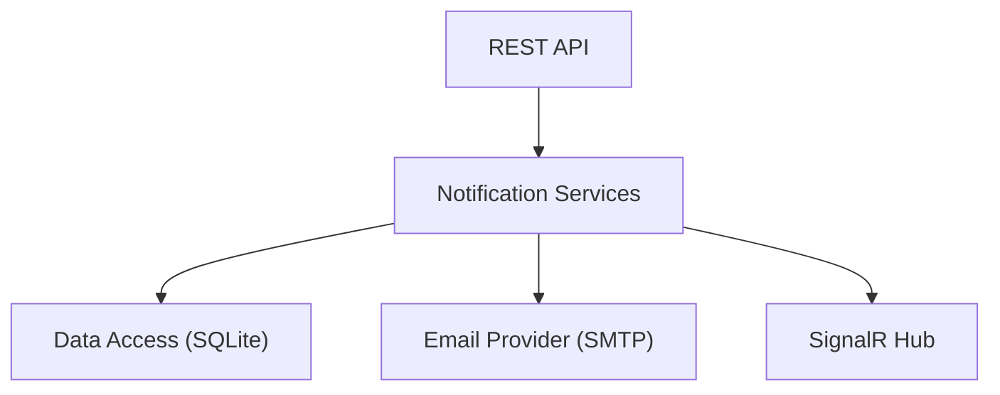

# Универсальный сервис уведомлений

Универсальный, расширяемый сервис уведомлений с REST API и поддержкой SignalR для отправки уведомлений через несколько каналов (Email, хранение в БД и InApp).

## Обзор проекта

Сервис уведомлений разработан как универсальное решение для управления и доставки уведомлений. Он поддерживает различные типы уведомлений и каналы доставки, обеспечивая получение пользователями важных обновлений в режиме реального времени или традиционными способами, такими как электронная почта.

### Ключевые особенности

- **Универсальные обработчики**: Легко расширяемая система для различных типов уведомлений (например, регистрация пользователя, обновление заказа).
- **Доставка в реальном времени**: Интеграция с SignalR для мгновенных InApp уведомлений.
- **Адресные уведомления**: Безопасная доставка конкретным пользователям с использованием JWT-аутентификации.
- **Многоканальная поддержка**: Доставка через Email (SMTP) и InApp (SignalR + БД).
- **Автоматическая очистка**: Запланированная служба для удаления старых уведомлений на основе настраиваемых политик хранения.

### Архитектура

Проект следует модульной архитектуре с четким разделением ответственности:
- **Бэкенд**: .NET 8 REST API, хабы SignalR и Entity Framework Core с SQLite.
- **Фронтенд**: Компонент уведомлений на базе React для легкой интеграции в веб-приложения.

## Оглавление документации

### 🖥️ Документация бэкенда
- [Обзор](backend/docs/ru/01-Overview.md)
- [Архитектура](backend/docs/ru/02-Architecture.md)
- [Справочник API](backend/docs/ru/04-API.md)
- [Руководство разработчика](backend/docs/ru/06-Development-Guide.md)
- [Служба очистки](backend/docs/ru/NOTIFICATION_CLEANUP.md)

### 🌐 Документация фронтенда
- [Обзор компонента](frontend/docs/ru/README.md)
- [Руководство по интеграции](frontend/docs/ru/INTEGRATION.md)

### ⚙️ Конфигурация
- [Руководство по конфигурации](CONFIGURATION_RU.md)

## Быстрый старт

1. **Бэкенд**: Перейдите в `backend/`, выполните `dotnet run --project src/NotificationService.Api`.
2. **Фронтенд**: Перейдите в `frontend/notification-component-mvp/`, выполните `npm install` и `npm run dev`.

Для получения подробных инструкций, пожалуйста, обратитесь к соответствующим разделам документации.
