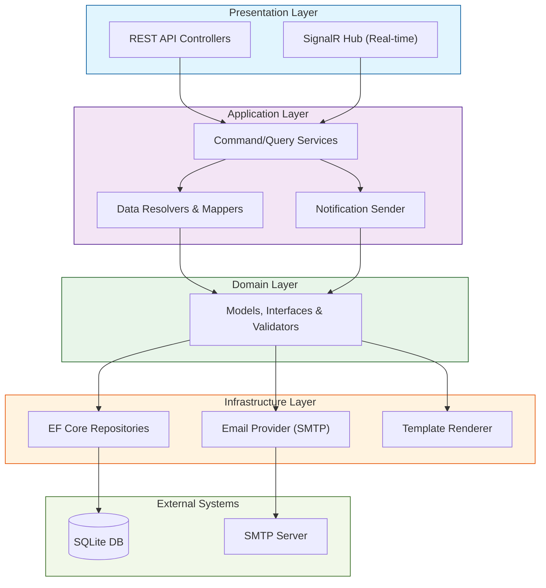
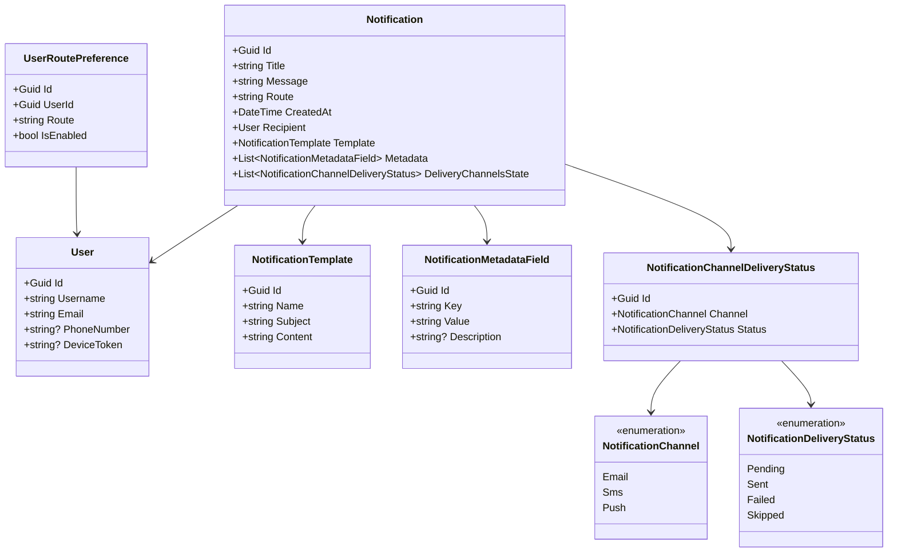
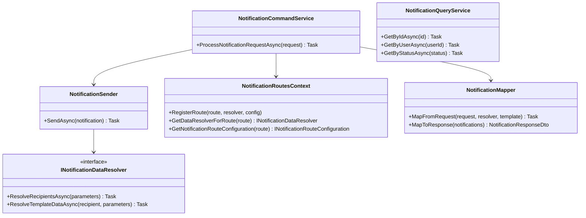
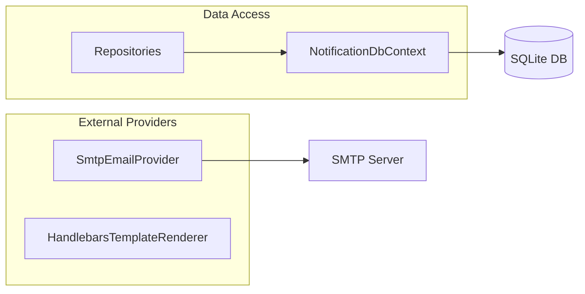
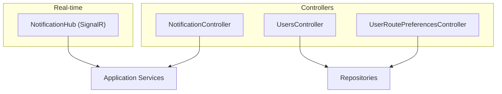
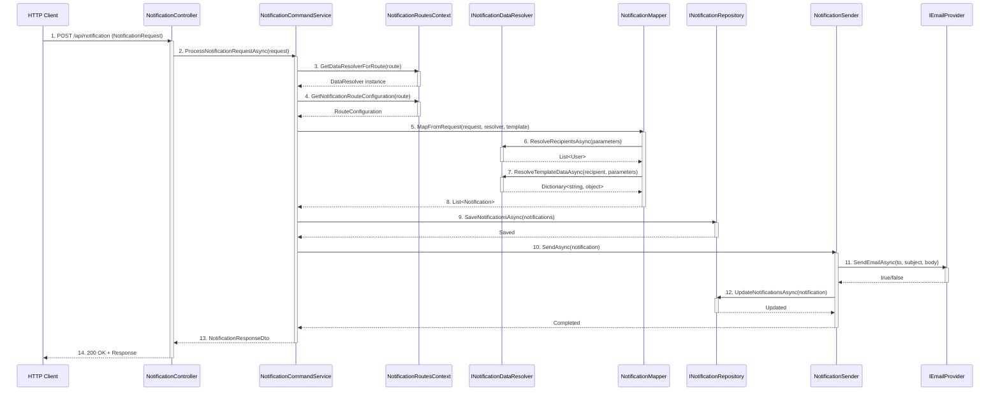

# System Architecture

## Overall Architecture

The project is organized according to **Clean Architecture** principles with clear separation of responsibilities between layers.

### High-Level Diagram



The system consists of 4 main layers:

1. **Presentation Layer** — REST API controllers and SignalR Hub
2. **Application Layer** — business logic and orchestration
3. **Domain Layer** — domain models and interfaces
4. **Infrastructure Layer** — implementation of data access and external services

## Multi-Layered Structure

### 1. NotificationService.Domain (Domain Layer)

**Responsibility:** Contains business logic, domain models, and interfaces.

**Has no dependencies** on other layers (except BCL).

**Main Components:**
- **Models:** `Notification`, `User`, `NotificationTemplate`, `UserRoutePreference`
- **Enumerations:** `NotificationChannel`, `NotificationDeliveryStatus`
- **Repository Interfaces:** `INotificationRepository`, `IUserRepository`, `ITemplateRepository`
- **Provider Interfaces:** `IEmailProvider`, `ISmsProvider`, `IPushNotificationProvider`
- **Configuration Interfaces:** `INotificationRouteConfiguration`

#### Domain Layer Diagram



### 2. NotificationService.Application (Application Layer)

**Responsibility:** Coordinates business scenario execution (use cases).

**Depends on:** Domain

**Main Components:**
- **Services:** `NotificationCommandService`, `NotificationQueryService`, `NotificationSender`
- **Routes:** `NotificationRoutesContext` — notification handler registry
- **Data Resolvers:** `INotificationDataResolver` — data retrieval for notifications
- **Mapping:** `NotificationMapper` — transformation between models and DTOs
- **DTOs:** `NotificationRequest`, `NotificationResponseDto`, `UserDto`

#### Application Layer Diagram



### 3. NotificationService.Infrastructure (Infrastructure Layer)

**Responsibility:** Implements interfaces for working with external systems.

**Depends on:** Domain, Application (partially)

**Main Components:**
- **EF Core:** `NotificationDbContext`, entity configurations
- **Repositories:** `NotificationRepository`, `UserRepository`, `TemplateRepository`
- **Email Provider:** `SmtpEmailProvider`, `SmtpClientFactory`
- **Template Rendering:** `HandlebarsTemplateRenderer`, `FileSystemTemplateProvider`
- **DB Initialization:** `DbInitializer`, migrations

#### Infrastructure Layer Diagram



### 4. NotificationService.Api (API Layer)

**Responsibility:** Application entry point, web server, controllers, DI composition.

**Depends on:** Application, Infrastructure

**Main Components:**
- **Controllers:** `NotificationController`, `UsersController`, `UserRoutePreferencesController`
- **SignalR Hub:** `NotificationHub` for real-time notifications
- **Middleware:** `ErrorHandlingMiddleware` for error handling
- **DI Configuration:** registration of all services

#### API Layer Diagram



### 5. NotificationService.TestHandlers (Test Handlers)

**Responsibility:** Contains example notification handlers.

**Depends on:** Domain, Application

**Handler Structure:**
```
MyNotification/
├── MyNotificationDataResolver.cs      # Data resolver
├── MyNotificationRouteConfig.cs       # Route configuration
├── MyNotification.hbs                 # HTML template
└── template.json                      # Template metadata
```

**Example Handlers:**
- `UserRegistered` — user registration
- `OrderCreated` — order creation
- `TaskAssigned` — task assignment

## Layer Interaction

### Dependency Rules

1. **Domain** depends on nothing
2. **Application** depends only on **Domain**
3. **Infrastructure** depends on **Domain** (and partially on **Application**)
4. **Api** depends on **Application** and **Infrastructure**
5. **TestHandlers** depends on **Domain** and **Application**

### Data Flow (Vertical Slice)



**Main Stages:**
1. HTTP request arrives at controller
2. Controller passes request to CommandService
3. CommandService obtains data resolver from NotificationRoutesContext
4. Resolver determines recipients and prepares data
5. Mapper creates Notification objects with rendered template
6. Notifications are saved to DB
7. NotificationSender sends via all active channels
8. Delivery statuses are updated in DB
9. Response is returned to client

## Key System Components

### NotificationRoutesContext

Central registry of notification routes and their handlers.

**Functions:**
- Register new notification routes
- Get data resolver by route
- Get route configuration

### NotificationSender

Service for orchestrating notification delivery across various channels.

**Functions:**
- Notification validation
- User preference checking
- Sending via all active channels
- Delivery status updates

### INotificationDataResolver

Interface for notification data resolvers.

**Responsibility:**
- Retrieve recipient data by request parameters
- Enrich notification with template data

### Delivery Channel Providers

Implementations for different channels:
- `IEmailProvider` / `SmtpEmailProvider` — Email via SMTP
- `ISmsProvider` — SMS (interface for extension)
- `IPushNotificationProvider` — Push notifications (interface for extension)

### Template System

Template system for formatting notifications.

**Components:**
- `ITemplateRenderer` — rendering interface
- `HandlebarsTemplateRenderer` — Handlebars implementation
- `FileSystemTemplateProvider` — load templates from file system
- `TemplateRepository` — template storage

## Design Patterns

### Repository Pattern
Data access abstraction through repository interfaces.

### Dependency Injection
All dependencies injected through constructors and registered in DI container.

### Strategy Pattern
Different delivery providers implement a common interface.

### Command/Query Separation
Separation of commands (state changes) and queries (data reads).

### Factory Pattern
`SmtpClientFactory` for creating SMTP clients.

## SignalR Integration

### NotificationHub

SignalR Hub for real-time notifications.

**Methods:**
- `BroadcastNotification(notification)` — broadcast to all connected clients
- `SendToUser(userId, notification)` — send to specific user

**Connection:**
```
URL: /notificationHub
Events: ReceiveNotification
```

## Database

### Database Schema (SQLite)

**Tables:**
- `Notifications` — main notifications table
- `Users` — users
- `NotificationTemplates` — notification templates
- `NotificationMetadataFields` — notification metadata (key-value)
- `NotificationChannelDeliveryStatuses` — delivery statuses by channel
- `UserRoutePreferences` — user preferences for routes

### Migrations

Entity Framework Core is used to create and apply database migrations.

## Configuration

Application configuration is done through:
- `appsettings.json` — base settings
- `appsettings.Development.json` — development settings
- Environment variables — for production

**Main Sections:**
- `ConnectionStrings:Notifications` — database connection string
- `Email` — SMTP settings
- `TemplateOptions` — template paths

## Security

### Validation
- Data validation at Domain level
- Input validation in controllers

### Error Handling
- `ErrorHandlingMiddleware` for centralized exception handling
- Error logging

### CORS
- Configurable CORS policy for frontend applications

## Extensibility

The system is designed for easy extension:

1. **New notification types** — add `INotificationDataResolver` and `INotificationRouteConfiguration`
2. **New delivery channels** — implement provider interface and register in DI
3. **New data sources** — add repository or provider
4. **New templates** — add `.hbs` file and `template.json`

## Next Steps

1. Explore [Key Components](./03-Components.md) in detail
2. Review the [API](./04-API.md)
3. Read the [Developer Guide](./06-Development-Guide.md) to add functionality
