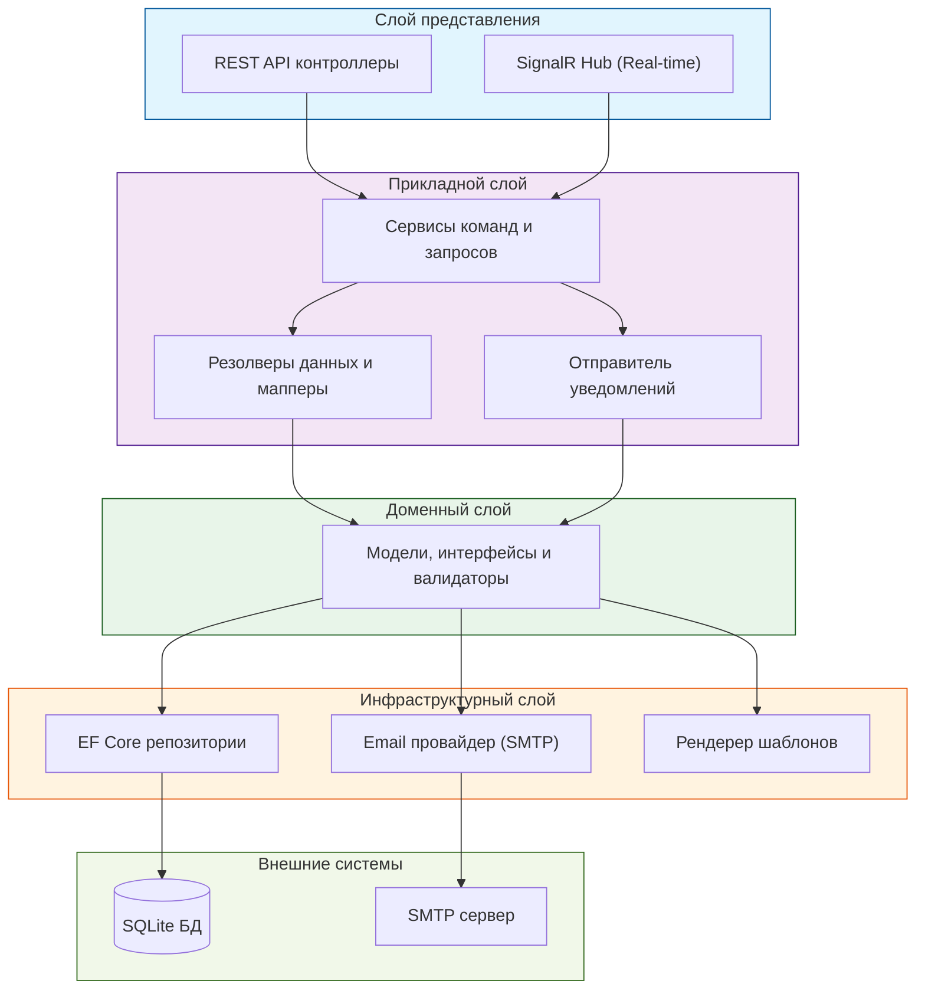
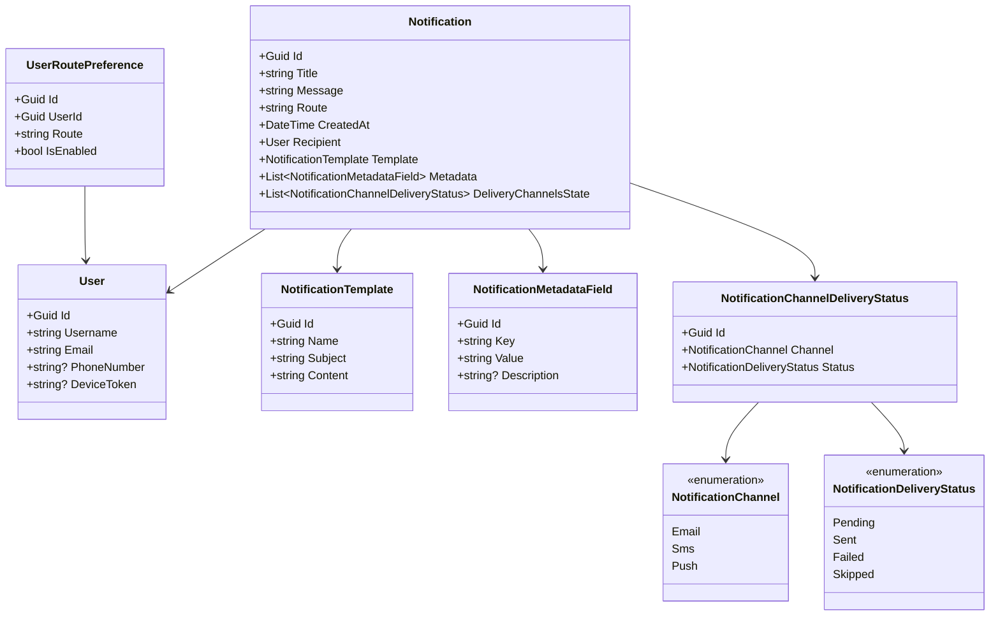
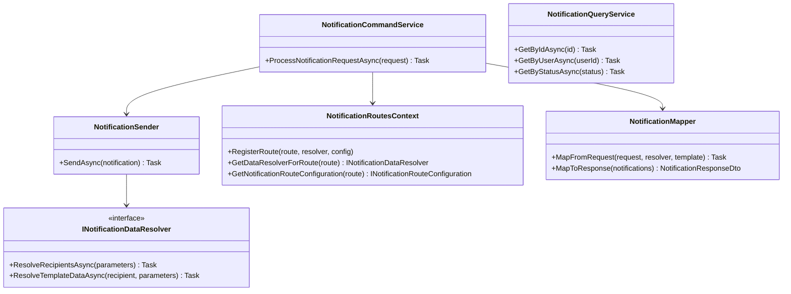
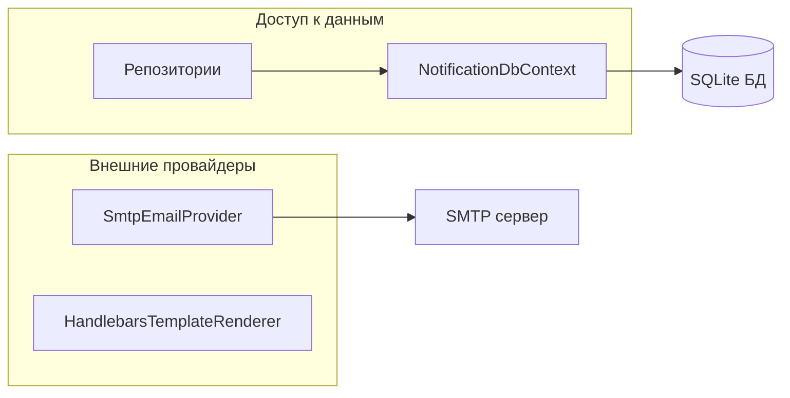
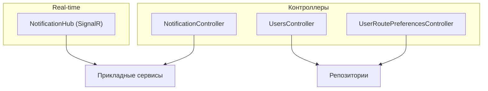
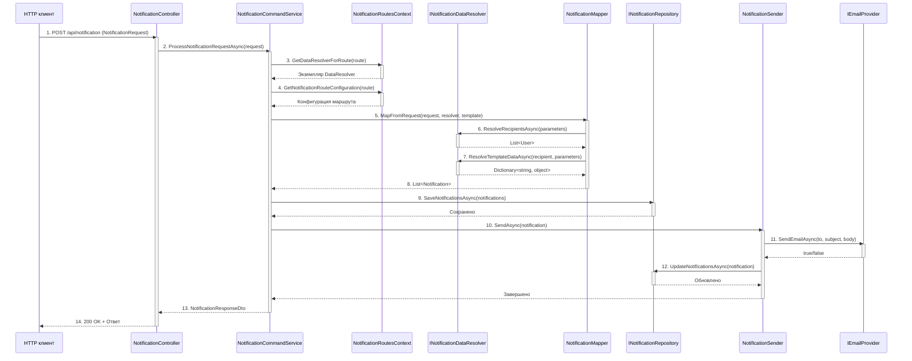

# Архитектура системы

## Общая архитектура

Проект организован по принципам **Clean Architecture** (Чистая архитектура) с четким разделением ответственности между слоями.

### Диаграмма высокого уровня



Система состоит из 4 основных слоев:

1. **Presentation Layer** — REST API контроллеры и SignalR Hub
2. **Application Layer** — бизнес-логика и оркестрация
3. **Domain Layer** — доменные модели и интерфейсы
4. **Infrastructure Layer** — реализация доступа к данным и внешним сервисам

## Многослойная структура

### 1. NotificationService.Domain (Доменный слой)

**Ответственность:** Содержит бизнес-логику, доменные модели и интерфейсы.

**Не зависит от других слоев** (кроме BCL).

**Основные компоненты:**
- **Модели:** `Notification`, `User`, `NotificationTemplate`, `UserRoutePreference`
- **Перечисления:** `NotificationChannel`, `NotificationDeliveryStatus`
- **Интерфейсы репозиториев:** `INotificationRepository`, `IUserRepository`, `ITemplateRepository`
- **Интерфейсы провайдеров:** `IEmailProvider`, `ISmsProvider`, `IPushNotificationProvider`
- **Конфигурационные интерфейсы:** `INotificationRouteConfiguration`

#### Диаграмма доменного слоя



### 2. NotificationService.Application (Прикладной слой)

**Ответственность:** Координирует выполнение бизнес-сценариев (use cases).

**Зависит от:** Domain

**Основные компоненты:**
- **Сервисы:** `NotificationCommandService`, `NotificationQueryService`, `NotificationSender`
- **Маршруты:** `NotificationRoutesContext` — реестр обработчиков уведомлений
- **Резолверы данных:** `INotificationDataResolver` — получение данных для уведомлений
- **Маппинг:** `NotificationMapper` — преобразование между моделями и DTO
- **DTO:** `NotificationRequest`, `NotificationResponseDto`, `UserDto`

#### Диаграмма прикладного слоя



### 3. NotificationService.Infrastructure (Инфраструктурный слой)

**Ответственность:** Реализует интерфейсы для работы с внешними системами.

**Зависит от:** Domain, Application (частично)

**Основные компоненты:**
- **EF Core:** `NotificationDbContext`, конфигурации сущностей
- **Репозитории:** `NotificationRepository`, `UserRepository`, `TemplateRepository`
- **Email провайдер:** `SmtpEmailProvider`, `SmtpClientFactory`
- **Рендеринг шаблонов:** `HandlebarsTemplateRenderer`, `FileSystemTemplateProvider`
- **Инициализация БД:** `DbInitializer`, миграции

#### Диаграмма инфраструктурного слоя



### 4. NotificationService.Api (API слой)

**Ответственность:** Точка входа в приложение, веб-сервер, контроллеры, DI-композиция.

**Зависит от:** Application, Infrastructure

**Основные компоненты:**
- **Контроллеры:** `NotificationController`, `UsersController`, `UserRoutePreferencesController`
- **SignalR Hub:** `NotificationHub` для real-time уведомлений
- **Middleware:** `ErrorHandlingMiddleware` для обработки ошибок
- **DI конфигурация:** регистрация всех сервисов

#### Диаграмма API слоя



### 5. NotificationService.TestHandlers (Тестовые обработчики)

**Ответственность:** Содержит примеры обработчиков уведомлений.

**Зависит от:** Domain, Application

**Структура обработчика:**
```
MyNotification/
├── MyNotificationDataResolver.cs      # Резолвер данных
├── MyNotificationRouteConfig.cs       # Конфигурация маршрута
├── MyNotification.hbs                 # HTML шаблон
└── template.json                      # Метаданные шаблона
```

**Примеры обработчиков:**
- `UserRegistered` — регистрация пользователя
- `OrderCreated` — создание заказа
- `TaskAssigned` — назначение задачи

## Взаимодействие слоев

### Правила зависимостей

1. **Domain** не зависит ни от кого
2. **Application** зависит только от **Domain**
3. **Infrastructure** зависит от **Domain** (и частично от **Application**)
4. **Api** зависит от **Application** и **Infrastructure**
5. **TestHandlers** зависит от **Domain** and **Application**

### Поток данных (вертикальный срез)



**Основные этапы:**
1. HTTP запрос поступает в контроллер
2. Контроллер передает запрос в CommandService
3. CommandService получает резолвер данных из NotificationRoutesContext
4. Резолвер определяет получателей и подготавливает данные
5. Mapper создает объекты Notification с рендеринговым шаблоном
6. Уведомления сохраняются в БД
7. NotificationSender отправляет по всем активным каналам
8. Статусы доставки обновляются в БД
9. Ответ возвращается клиенту

## Ключевые компоненты системы

### NotificationRoutesContext

Центральный реестр маршрутов уведомлений и их обработчиков.

**Функции:**
- Регистрация новых маршрутов уведомлений
- Получение резолвера данных по маршруту
- Получение конфигурации маршрута

### NotificationSender

Сервис оркестрации отправки уведомлений по различным каналам.

**Функции:**
- Валидация уведомления
- Проверка пользовательских предпочтений
- Отправка по всем активным каналам
- Обновление статусов доставки

### INotificationDataResolver

Интерфейс для резолверов данных уведомлений.

**Ответственность:**
- Получение данных получателей по параметрам запроса
- Обогащение уведомления данными для шаблона

### Провайдеры каналов доставки

Реализации для различных каналов:
- `IEmailProvider` / `SmtpEmailProvider` — Email через SMTP
- `ISmsProvider` — SMS (интерфейс для расширения)
- `IPushNotificationProvider` — Push-уведомления (интерфейс для расширения)

### Template System

Система шаблонов для форматирования уведомлений.

**Компоненты:**
- `ITemplateRenderer` — интерфейс рендеринга
- `HandlebarsTemplateRenderer` — реализация на Handlebars
- `FileSystemTemplateProvider` — загрузка шаблонов из файловой системы
- `TemplateRepository` — хранилище шаблонов

## Паттерны проектирования

### Repository Pattern
Абстракция доступа к данным через интерфейсы репозиториев.

### Dependency Injection
Все зависимости внедряются через конструкторы и регистрируются в DI-контейнере.

### Strategy Pattern
Различные провайдеры доставки реализуют общий интерфейс.

### Command/Query Separation
Разделение команд (изменение состояния) и запросов (чтение данных).

### Factory Pattern
`SmtpClientFactory` для создания SMTP клиентов.

## SignalR интеграция

### NotificationHub

SignalR Hub для real-time уведомлений.

**Методы:**
- `BroadcastNotification(notification)` — рассылка всем подключенным клиентам
- `SendToUser(userId, notification)` — отправка конкретному пользователю

**Подключение:**
```
URL: /notificationHub
Events: ReceiveNotification
```

## База данных

### Схема БД (SQLite)

**Таблицы:**
- `Notifications` — основная таблица уведомлений
- `Users` — пользователи
- `NotificationTemplates` — шаблоны уведомлений
- `NotificationMetadataFields` — метаданные уведомлений (ключ-значение)
- `NotificationChannelDeliveryStatuses` — статусы доставки по каналам
- `UserRoutePreferences` — предпочтения пользователей по маршрутам

### Миграции

Entity Framework Core используется для создания и применения миграций базы данных.

## Конфигурация

Конфигурация приложения осуществляется через:
- `appsettings.json` — базовые настройки
- `appsettings.Development.json` — настройки для разработки
- Переменные окружения — для production

**Основные секции:**
- `ConnectionStrings:Notifications` — строка подключения к БД
- `Email` — настройки SMTP
- `TemplateOptions` — пути к шаблонам

## Безопасность

### Валидация
- Валидация данных на уровне Domain
- Проверка входных данных в контроллерах

### Обработка ошибок
- `ErrorHandlingMiddleware` для централизованной обработки исключений
- Логирование ошибок

### CORS
- Настраиваемая политика CORS для frontend приложений

## Расширяемость

Система спроектирована для легкого расширения:

1. **Новые типы уведомлений** — добавить `INotificationDataResolver` и `INotificationRouteConfiguration`
2. **Новые каналы доставки** — реализовать интерфейс провайдера и зарегистрировать в DI
3. **Новые источники данных** — добавить репозиторий или провайдер
4. **Новые шаблоны** — добавить `.hbs` файл и `template.json`

## Следующие шаги

1. Изучите [Ключевые компоненты](./03-Components.md) подробнее
2. Ознакомьтесь с [API](./04-API.md)
3. Прочитайте [Руководство разработчика](./06-Development-Guide.md) для добавления функциональности
