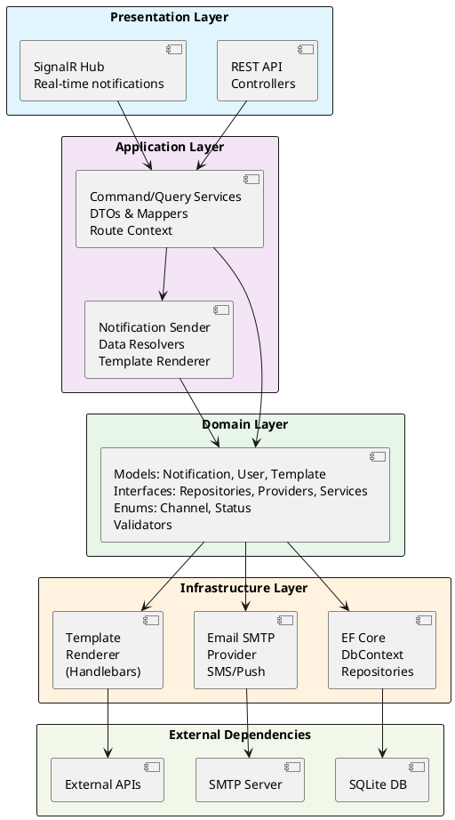
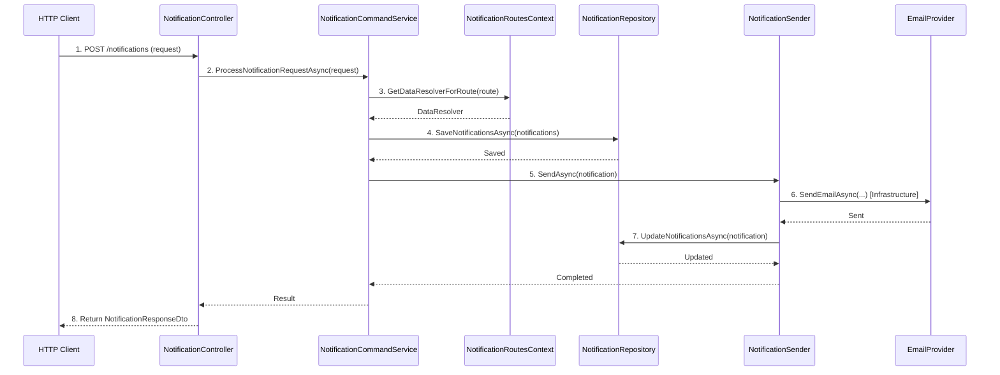
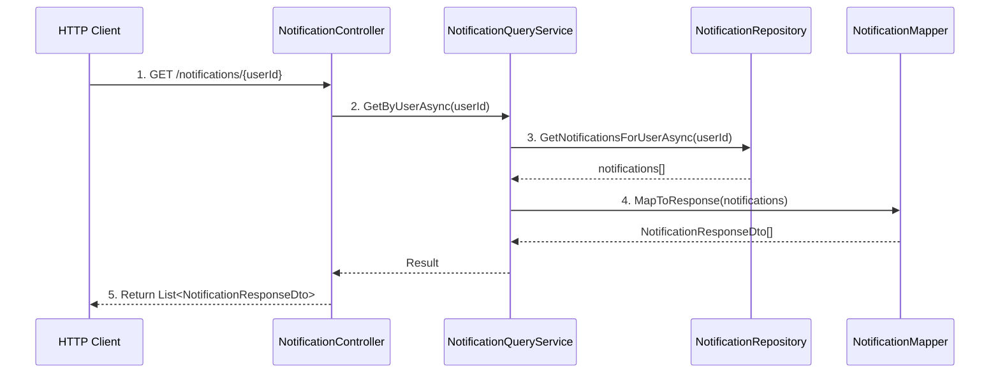

# Архитектура системы

## Общая архитектура

Проект организован по принципам **Clean Architecture** (Чистая архитектура) с четким разделением ответственности между слоями.

### Диаграмма высокого уровня



## Многослойная структура

Проект разделен на следующие проекты/слои:

### 1. NotificationService.Domain (Доменный слой)

**Ответственность:** Содержит бизнес-логику, доменные модели и интерфейсы.

**Не зависит от других слоев** (кроме BCL).

**Содержит:**
- Доменные модели (`Notification`, `User`, `NotificationTemplate`, `UserRoutePreference`)
- Перечисления (`NotificationChannel`, `NotificationDeliveryStatus`)
- Интерфейсы репозиториев (`INotificationRepository`, `IUserRepository`, `ITemplateRepository`)
- Интерфейсы провайдеров (`IEmailProvider`, `ISmsProvider`, `IPushNotificationProvider`)
- Валидаторы (`NotificationValidator`)
- Конфигурационные интерфейсы (`INotificationRouteConfiguration`)

### 2. NotificationService.Application (Прикладной слой)

**Ответственность:** Координирует выполнение бизнес-сценариев (use cases).

**Зависит от:** Domain

**Содержит:**
- DTO (Data Transfer Objects) для API (`NotificationRequest`, `NotificationResponseDto`, `UserDto`)
- Интерфейсы сервисов (`INotificationCommandService`, `INotificationQueryService`, `INotificationSender`)
- Реализации сервисов (`NotificationCommandService`, `NotificationQueryService`, `NotificationSender`)
- Мапперы (`INotificationMapper`, `NotificationMapper`)
- Интерфейсы для разрешения данных (`INotificationDataResolver`)
- Интерфейсы рендеринга шаблонов (`ITemplateRenderer`)
- Контекст маршрутов (`NotificationRoutesContext`)
- Extension-методы для регистрации в DI

### 3. NotificationService.Infrastructure (Инфраструктурный слой)

**Ответственность:** Реализует интерфейсы для работы с внешними системами.

**Зависит от:** Domain, Application (частично)

**Содержит:**
- EF Core контекст базы данных (`NotificationDbContext`)
- Конфигурации сущностей (Fluent API)
- Реализации репозиториев (`NotificationRepository`, `UserRepository`, `TemplateRepository`)
- Реализации провайдеров отправки (`SmtpEmailProvider`)
- Обвязка для SMTP (`SmtpClientFactory`, `SmtpClientWrapper`)
- Рендеринг шаблонов (`HandlebarsTemplateRenderer`, `FileSystemTemplateProvider`)
- Инициализация БД и миграции (`DbInitializer`)
- Опции конфигурации (`EmailProviderOptions`, `TemplateOptions`)

### 4. NotificationService.Api (API слой)

**Ответственность:** Точка входа в приложение, веб-сервер, контроллеры, DI-композиция.

**Зависит от:** Application, Infrastructure

**Содержит:**
- Контроллеры REST API (`NotificationController`, `UsersController`, `UserRoutePreferencesController`)
- SignalR Hubs (`NotificationHub`)
- Middleware (`ErrorHandlingMiddleware`)
- DI конфигурация (`NotificationServiceDiConfigurationExtensions`)
- Swagger расширения (`NotificationDocumentFilter`)
- Точка входа приложения (`Program.cs`)

### 5. NotificationService.TestHandlers (Тестовые обработчики)

**Ответственность:** Содержит примеры обработчиков уведомлений.

**Зависит от:** Domain, Application

**Содержит:**
- Реализации обработчиков для различных типов уведомлений:
  - `UserRegistered` — регистрация пользователя
  - `OrderCreated` — создание заказа
  - `TaskAssigned` — назначение задачи
- HTML шаблоны (`.hbs` файлы)
- Конфигурации шаблонов (`template.json`)
- Регистрацию обработчиков (`NotificationServicesRegister`)

## Взаимодействие слоев

### Правила зависимостей

1. **Domain** не зависит ни от кого
2. **Application** зависит только от **Domain**
3. **Infrastructure** зависит от **Domain** (и частично от **Application**)
4. **Api** зависит от **Application** и **Infrastructure**
5. **TestHandlers** зависит от **Domain** и **Application**

### Поток данных (вертикальный срез)

#### Создание и отправка уведомления



#### Получение уведомлений пользователя



## Ключевые компоненты системы

### 1. Notification (Доменная модель)

Центральная сущность системы, представляющая уведомление.

**Свойства:**
- `Id` — уникальный идентификатор
- `Title` — заголовок уведомления
- `Message` — содержимое уведомления
- `Route` — тип/маршрут уведомления
- `CreatedAt` — время создания
- `Recipient` — получатель (User)
- `Template` — шаблон для форматирования
- `Metadata` — метаданные (ключ-значение-описание)
- `DeliveryChannelsState` — статусы доставки по каналам

### 2. NotificationRoutesContext

Центральный реестр маршрутов уведомлений и их обработчиков.

**Функции:**
- Регистрация новых маршрутов уведомлений
- Получение резолвера данных по маршруту
- Получение конфигурации маршрута

### 3. NotificationSender

Сервис оркестрации отправки уведомлений по различным каналам.

**Функции:**
- Валидация уведомления
- Проверка пользовательских предпочтений
- Отправка по всем активным каналам
- Обновление статусов доставки

### 4. INotificationDataResolver

Интерфейс для резолверов данных уведомлений.

**Ответственность:**
- Получение данных получателей по параметрам запроса
- Обогащение уведомления данными

### 5. Провайдеры каналов доставки

Реализации для различных каналов:
- `IEmailProvider` / `SmtpEmailProvider` — Email через SMTP
- `ISmsProvider` — SMS (интерфейс для расширения)
- `IPushNotificationProvider` — Push-уведомления (интерфейс для расширения)

### 6. Template System

Система шаблонов для форматирования уведомлений.

**Компоненты:**
- `ITemplateRenderer` — интерфейс рендеринга
- `HandlebarsTemplateRenderer` — реализация на Handlebars
- `FileSystemTemplateProvider` — загрузка шаблонов из файловой системы
- `TemplateRepository` — хранилище шаблонов

## Паттерны проектирования

### Repository Pattern
Абстракция доступа к данным через интерфейсы репозиториев.

### Dependency Injection
Все зависимости внедряются через конструкторы и регистрируются в DI-контейнере.

### Strategy Pattern
Различные провайдеры доставки реализуют общий интерфейс.

### Command/Query Separation
Разделение команд (изменение состояния) и запросов (чтение данных).

### Factory Pattern
`SmtpClientFactory` для создания SMTP клиентов.

## SignalR интеграция

### NotificationHub

SignalR Hub для real-time уведомлений.

**Методы:**
- `BroadcastNotification(notification)` — рассылка всем подключенным клиентам
- `SendToUser(userId, notification)` — отправка конкретному пользователю

**Подключение:**
```
URL: /notificationHub
Events: ReceiveNotification
```

## База данных

### Схема БД (SQLite)

**Таблицы:**
- `Notifications` — основная таблица уведомлений
- `Users` — пользователи
- `NotificationTemplates` — шаблоны уведомлений
- `NotificationMetadataFields` — метаданные уведомлений (ключ-значение)
- `NotificationChannelDeliveryStatuses` — статусы доставки по каналам
- `UserRoutePreferences` — предпочтения пользователей по маршрутам

### Миграции

Entity Framework Core используется для создания и применения миграций базы данных.

## Конфигурация

Конфигурация приложения осуществляется через:
- `appsettings.json` — базовые настройки
- `appsettings.Development.json` — настройки для разработки
- Переменные окружения — для production

**Основные секции:**
- `ConnectionStrings:Notifications` — строка подключения к БД
- `Email` — настройки SMTP
- `TemplateOptions` — пути к шаблонам

## Безопасность

### Валидация
- Валидация данных на уровне Domain (`NotificationValidator`)
- Проверка входных данных в контроллерах

### Обработка ошибок
- `ErrorHandlingMiddleware` для централизованной обработки исключений
- Логирование ошибок

### CORS
- Настраиваемая политика CORS для frontend приложений

## Расширяемость

Система спроектирована для легкого расширения:

1. **Новые типы уведомлений** — добавить `INotificationDataResolver` и `INotificationRouteConfiguration`
2. **Новые каналы доставки** — реализовать интерфейс провайдера и зарегистрировать в DI
3. **Новые источники данных** — добавить репозиторий или провайдер
4. **Новые шаблоны** — добавить `.hbs` файл и `template.json`

## Следующие шаги

1. Изучите [Ключевые компоненты](./03-Components.md) подробнее
2. Ознакомьтесь с [API](./04-API.md)
3. Прочитайте [Руководство разработчика](./06-Development-Guide.md) для добавления функциональности
