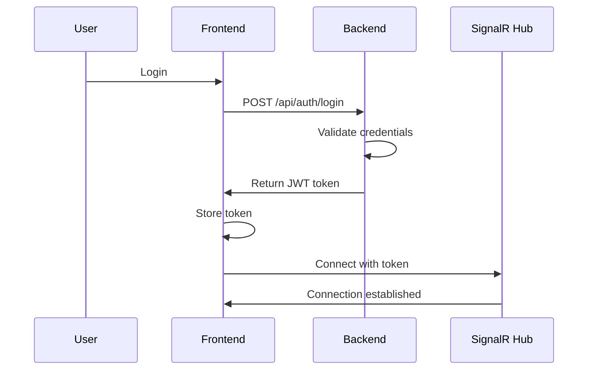
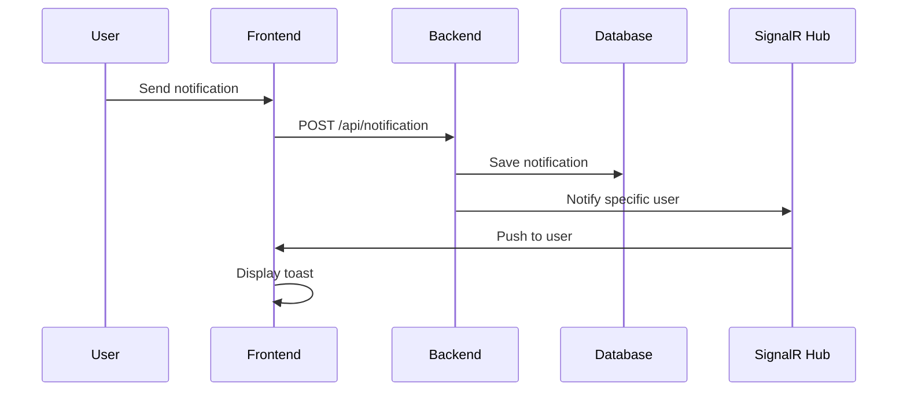

# Showcase Application

Full-featured demonstration application showcasing all notification service capabilities with user authentication and targeted delivery via SignalR.

## Overview

The Showcase application is a production-ready example of integrating the notification service into a real application. It demonstrates:

- 🔐 **JWT Authentication** — secure user registration and login
- 🎯 **Targeted Notifications** — delivery only to specific users
- 📱 **Real-time Updates** — instant delivery via SignalR
- 🎨 **Modern UI** — Tailwind CSS with gradients and animations
- 📊 **MobX State Management** — reactive data updates
- ⚡ **Vite** — fast development and build

## Architecture

### Technology Stack

**Backend:**
- .NET 8
- JWT Authentication
- SignalR for real-time
- SQLite database
- Entity Framework Core

**Frontend:**
- React 18
- TypeScript
- MobX (state management)
- Tailwind CSS
- Vite (build tool)
- SignalR Client

## Quick Start

### Automatic Setup

**Linux/Mac:**
```bash
cd showcase
./start.sh
```

**Windows:**
```bash
cd showcase
start.bat
```

This will:
- Start backend on http://localhost:5093
- Start frontend on http://localhost:3000

### Manual Setup

**1. Start Backend:**
```bash
cd backend
dotnet run --project src/NotificationService.Api
```

**2. Start Frontend:**
```bash
cd showcase/frontend
npm install
npm run dev
```

**3. Open Browser:**
```
http://localhost:3000
```

## Features

### 1. User Authentication

**Registration:**
- Create new user account
- Automatic profile creation
- JWT token generation

**Login:**
- Email/password authentication
- JWT token storage
- Automatic session management

### 2. Dashboard

**Features:**
- User profile display
- Quick stats (unread notifications)
- Send test notifications
- Notification type selection

**Available Test Notifications:**
- UserRegistered
- OrderCreated
- TaskAssigned

### 3. Real-time Notifications

**Targeted Delivery:**
- Notifications sent only to specific users
- JWT-authenticated SignalR connection
- Automatic reconnection

**Display:**
- Toast notifications for new alerts
- Notification center with history
- Unread count badge
- Mark as read functionality

### 4. Notification Center

**Features:**
- View all notifications
- Filter by read/unread
- Mark individual notifications as read
- Real-time updates

## User Guide

### Step 1: Create Account

1. Open http://localhost:3000
2. Click "Sign Up"
3. Enter username, email, and password
4. Click "Create Account"
5. You'll be automatically logged in

### Step 2: Send Test Notifications

1. From the dashboard, select notification type
2. Fill in required parameters
3. Click "Send Notification"
4. Notification appears in real-time

### Step 3: View Notifications

1. Click the bell icon (top right)
2. View your notification history
3. Click notifications to mark as read
4. Filter by read/unread status

## Architecture Details

### Authentication Flow



### Notification Flow



### Key Components

**Backend:**
- `AuthController` — handles login/register
- `NotificationController` — manages notifications
- `NotificationHub` — SignalR hub with targeted delivery
- `CustomUserIdProvider` — extracts userId from JWT

**Frontend:**
- `AuthStore` — manages authentication state
- `NotificationStore` — manages notification state
- `Dashboard` — main application view
- `NotificationCenter` — notification display
- `ToastProvider` — real-time toast notifications

## Configuration

### Backend (appsettings.json)

```json
{
  "ConnectionStrings": {
    "Notifications": "Data Source=showcase.db"
  },
  "JwtSettings": {
    "Secret": "your-secret-key-min-32-chars",
    "Issuer": "NotificationShowcase",
    "Audience": "ShowcaseUsers",
    "ExpirationMinutes": 60
  },
  "Cors": {
    "AllowedOrigins": ["http://localhost:3000"]
  }
}
```

### Frontend (.env)

```env
VITE_API_BASE_URL=http://localhost:5093
VITE_SIGNALR_HUB_URL=http://localhost:5093/notificationHub
```

## Customization

### Adding Custom Notification Types

1. Create handler in `NotificationService.TestHandlers`
2. Add to notification type dropdown in `Dashboard.tsx`
3. Implement parameter form in frontend

### Styling

Customize Tailwind configuration:

```javascript
// tailwind.config.js
module.exports = {
  theme: {
    extend: {
      colors: {
        primary: '#your-color',
        secondary: '#your-color'
      }
    }
  }
}
```

## Deployment

### Production Build

**Backend:**
```bash
dotnet publish -c Release
```

**Frontend:**
```bash
npm run build
```

### Docker

```bash
docker-compose up --build
```

## Troubleshooting

### Backend Issues

**Port already in use:**
```bash
# Change port in launchSettings.json
"applicationUrl": "http://localhost:5094"
```

**Database errors:**
```bash
# Delete database and restart
rm showcase.db
dotnet run
```

### Frontend Issues

**SignalR connection fails:**
- Check CORS configuration
- Verify backend is running
- Check console for errors

**Authentication errors:**
- Clear browser localStorage
- Check JWT secret configuration

## Next Steps

1. Explore the [API Documentation](./04-API.md)
2. Review [Integration Guide](./07-Integration-Guide.md)
3. Check [Developer Guide](./06-Development-Guide.md) for customization
