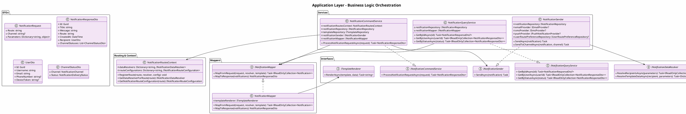

```plantuml
@startuml Application Layer
!theme plain
skinparam backgroundColor #FEFEFE
skinparam classBackgroundColor #F3E5F5
skinparam classBorderColor #6A1B9A

title Application Layer - Business Logic Orchestration

package "Services" {
    class NotificationCommandService {
        - notificationRoutesContext: NotificationRoutesContext
        - notificationRepository: INotificationRepository
        - templateRepository: ITemplateRepository
        - notificationSender: INotificationSender
        - notificationMapper: INotificationMapper
        + ProcessNotificationRequestAsync(request): Task<NotificationResponseDto>
    }

    class NotificationQueryService {
        - notificationRepository: INotificationRepository
        - notificationMapper: INotificationMapper
        + GetByIdAsync(id): Task<NotificationResponseDto?>
        + GetByUserAsync(userId): Task<IReadOnlyCollection<NotificationResponseDto>>
        + GetByStatusAsync(status): Task<IReadOnlyCollection<NotificationResponseDto>>
    }

    class NotificationSender {
        - notificationRepository: INotificationRepository
        - emailProvider: IEmailProvider?
        - smsProvider: ISmsProvider?
        - pushProvider: IPushNotificationProvider?
        - userRoutePreferenceRepository: IUserRoutePreferenceRepository?
        + SendAsync(notification): Task
        - SendToChannelAsync(notification, channel): Task
    }
}

package "Routing & Context" {
    class NotificationRoutesContext {
        - dataResolvers: Dictionary<string, INotificationDataResolver>
        - routeConfigurations: Dictionary<string, INotificationRouteConfiguration>
        + RegisterRoute(route, resolver, config): void
        + GetDataResolverForRoute(route): INotificationDataResolver
        + GetNotificationRouteConfiguration(route): INotificationRouteConfiguration
    }
}

package "Mappers" {
    interface INotificationMapper {
        + MapFromRequest(request, resolver, template): Task<IReadOnlyCollection<Notification>>
        + MapToResponse(notifications): NotificationResponseDto
    }

    class NotificationMapper {
        - templateRenderer: ITemplateRenderer
        + MapFromRequest(request, resolver, template): Task<IReadOnlyCollection<Notification>>
        + MapToResponse(notifications): NotificationResponseDto
    }
}

package "Interfaces" {
    interface INotificationCommandService {
        + ProcessNotificationRequestAsync(request): Task<NotificationResponseDto>
    }

    interface INotificationQueryService {
        + GetByIdAsync(id): Task<NotificationResponseDto?>
        + GetByUserAsync(userId): Task<IReadOnlyCollection<NotificationResponseDto>>
        + GetByStatusAsync(status): Task<IReadOnlyCollection<NotificationResponseDto>>
    }

    interface INotificationSender {
        + SendAsync(notification): Task
    }

    interface INotificationDataResolver {
        + ResolveRecipientsAsync(parameters): Task<IReadOnlyCollection<User>>
        + ResolveTemplateDataAsync(recipient, parameters): Task<Dictionary<string, object>>
    }

    interface ITemplateRenderer {
        + RenderAsync(template, data): Task<string>
    }
}

package "DTOs" {
    class NotificationRequest {
        + Route: string
        + Channel: string?
        + Parameters: Dictionary<string, object>
    }

    class NotificationResponseDto {
        + Id: Guid
        + Title: string
        + Message: string
        + Route: string
        + CreatedAt: DateTime
        + Recipient: UserDto
        + ChannelStatuses: List<ChannelStatusDto>
    }

    class UserDto {
        + Id: Guid
        + Username: string
        + Email: string
        + PhoneNumber: string?
        + DeviceToken: string?
    }

    class ChannelStatusDto {
        + Channel: NotificationChannel
        + Status: NotificationDeliveryStatus
    }
}

NotificationCommandService --> NotificationRoutesContext
NotificationCommandService --> INotificationSender
NotificationCommandService --> INotificationMapper
NotificationQueryService --> INotificationMapper
NotificationSender --> INotificationDataResolver
NotificationMapper --> ITemplateRenderer
INotificationCommandService <|.. NotificationCommandService
INotificationQueryService <|.. NotificationQueryService
INotificationSender <|.. NotificationSender
INotificationMapper <|.. NotificationMapper

@enduml
```