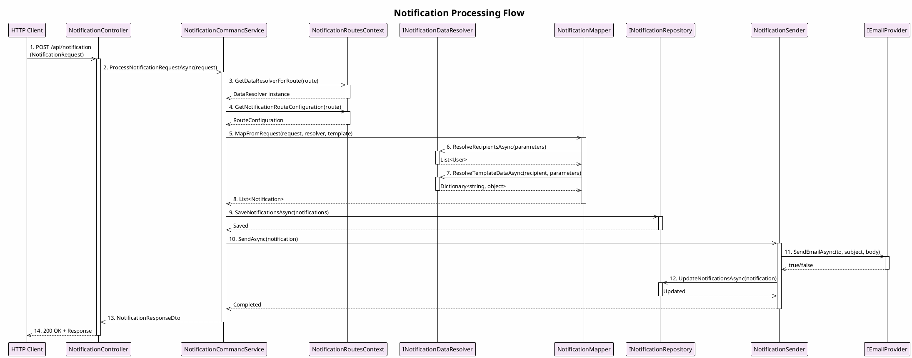

```plantuml
@startuml Data Flow - Notification Processing
!theme plain
skinparam backgroundColor #FEFEFE
skinparam sequenceActorBackgroundColor #E1F5FE
skinparam sequenceParticipantBackgroundColor #F3E5F5

title Notification Processing Flow

participant "HTTP Client" as Client
participant "NotificationController" as Controller
participant "NotificationCommandService" as CommandService
participant "NotificationRoutesContext" as RoutesContext
participant "INotificationDataResolver" as DataResolver
participant "NotificationMapper" as Mapper
participant "INotificationRepository" as Repository
participant "NotificationSender" as Sender
participant "IEmailProvider" as EmailProvider

Client ->> Controller: 1. POST /api/notification\n(NotificationRequest)
activate Controller

Controller ->> CommandService: 2. ProcessNotificationRequestAsync(request)
activate CommandService

CommandService ->> RoutesContext: 3. GetDataResolverForRoute(route)
activate RoutesContext
RoutesContext -->> CommandService: DataResolver instance
deactivate RoutesContext

CommandService ->> RoutesContext: 4. GetNotificationRouteConfiguration(route)
activate RoutesContext
RoutesContext -->> CommandService: RouteConfiguration
deactivate RoutesContext

CommandService ->> Mapper: 5. MapFromRequest(request, resolver, template)
activate Mapper

Mapper ->> DataResolver: 6. ResolveRecipientsAsync(parameters)
activate DataResolver
DataResolver -->> Mapper: List<User>
deactivate DataResolver

Mapper ->> DataResolver: 7. ResolveTemplateDataAsync(recipient, parameters)
activate DataResolver
DataResolver -->> Mapper: Dictionary<string, object>
deactivate DataResolver

Mapper -->> CommandService: 8. List<Notification>
deactivate Mapper

CommandService ->> Repository: 9. SaveNotificationsAsync(notifications)
activate Repository
Repository -->> CommandService: Saved
deactivate Repository

CommandService ->> Sender: 10. SendAsync(notification)
activate Sender

Sender ->> EmailProvider: 11. SendEmailAsync(to, subject, body)
activate EmailProvider
EmailProvider -->> Sender: true/false
deactivate EmailProvider

Sender ->> Repository: 12. UpdateNotificationsAsync(notification)
activate Repository
Repository -->> Sender: Updated
deactivate Repository

Sender -->> CommandService: Completed
deactivate Sender

CommandService -->> Controller: 13. NotificationResponseDto
deactivate CommandService

Controller -->> Client: 14. 200 OK + Response
deactivate Controller

@enduml
```
