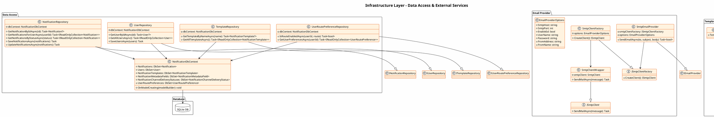

```plantuml
@startuml Infrastructure Layer
!theme plain
allowmixing
skinparam backgroundColor #FEFEFE
skinparam classBackgroundColor #FFF3E0
skinparam classBorderColor #E65100

title Infrastructure Layer - Data Access & External Services

package "Data Access" {
    class NotificationDbContext {
        + Notifications: DbSet<Notification>
        + Users: DbSet<User>
        + NotificationTemplates: DbSet<NotificationTemplate>
        + NotificationMetadataFields: DbSet<NotificationMetadataField>
        + NotificationChannelDeliveryStatuses: DbSet<NotificationChannelDeliveryStatus>
        + UserRoutePreferences: DbSet<UserRoutePreference>
        # OnModelCreating(modelBuilder): void
    }

    class NotificationRepository {
        - dbContext: NotificationDbContext
        + GetNotificationByIdAsync(id): Task<Notification?>
        + GetNotificationsForUserAsync(userId): Task<IReadOnlyCollection<Notification>>
        + GetNotificationsByStatusAsync(status): Task<IReadOnlyCollection<Notification>>
        + SaveNotificationsAsync(notifications): Task
        + UpdateNotificationsAsync(notifications): Task
    }

    class UserRepository {
        - dbContext: NotificationDbContext
        + GetUserByIdAsync(id): Task<User?>
        + GetAllUsersAsync(): Task<IReadOnlyCollection<User>>
        + SaveUsersAsync(users): Task
    }

    class TemplateRepository {
        - dbContext: NotificationDbContext
        + GetTemplateByNameAsync(name): Task<NotificationTemplate?>
        + GetAllTemplatesAsync(): Task<IReadOnlyCollection<NotificationTemplate>>
    }

    class UserRoutePreferenceRepository {
        - dbContext: NotificationDbContext
        + IsRouteEnabledAsync(userId, route): Task<bool>
        + GetUserPreferencesAsync(userId): Task<IReadOnlyCollection<UserRoutePreference>>
    }
}

package "Email Provider" {
    interface ISmtpClient {
        + SendMailAsync(message): Task
    }

    interface ISmtpClientFactory {
        + CreateClient(): ISmtpClient
    }

    class SmtpClientWrapper {
        - smtpClient: SmtpClient
        + SendMailAsync(message): Task
    }

    class SmtpClientFactory {
        - options: EmailProviderOptions
        + CreateClient(): ISmtpClient
    }

    class SmtpEmailProvider {
        - smtpClientFactory: ISmtpClientFactory
        - options: EmailProviderOptions
        + SendEmailAsync(to, subject, body): Task<bool>
    }

    class EmailProviderOptions {
        + SmtpHost: string
        + SmtpPort: int
        + EnableSsl: bool
        + UserName: string
        + Password: string
        + FromAddress: string
        + FromName: string
    }
}

package "Template Rendering" {
    interface ITemplateProvider {
        + GetTemplateAsync(name): Task<string>
    }

    class FileSystemTemplateProvider {
        - basePath: string
        + GetTemplateAsync(name): Task<string>
    }

    class HandlebarsTemplateRenderer {
        - RegisterHelpers(): void
        + RenderAsync(template, data): Task<string>
    }

    class TemplateOptions {
        + TemplatesBasePath: string
    }
}

package "Database" {
    database "SQLite DB" as DB
}

NotificationRepository --|> INotificationRepository
UserRepository --|> IUserRepository
TemplateRepository --|> ITemplateRepository
UserRoutePreferenceRepository --|> IUserRoutePreferenceRepository

SmtpEmailProvider --|> IEmailProvider
SmtpClientFactory --|> ISmtpClientFactory
SmtpClientWrapper --|> ISmtpClient
HandlebarsTemplateRenderer --|> ITemplateRenderer
FileSystemTemplateProvider --|> ITemplateProvider

NotificationRepository --> NotificationDbContext
UserRepository --> NotificationDbContext
TemplateRepository --> NotificationDbContext
UserRoutePreferenceRepository --> NotificationDbContext

SmtpEmailProvider --> ISmtpClientFactory
SmtpClientFactory --> SmtpClientWrapper
HandlebarsTemplateRenderer --> FileSystemTemplateProvider

NotificationDbContext --> DB

@enduml
```