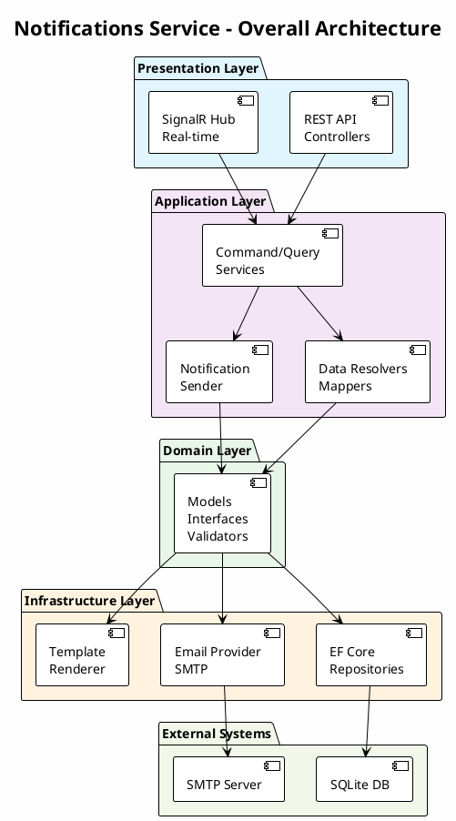

```plantuml
@startuml Overall Architecture
!theme plain
skinparam backgroundColor #FEFEFE
skinparam classBackgroundColor #F0F0F0
skinparam classBorderColor #333333

title Notifications Service - Overall Architecture

package "Presentation Layer" #E1F5FE {
    component "REST API\nControllers" as REST
    component "SignalR Hub\nReal-time" as SIGNALR
}

package "Application Layer" #F3E5F5 {
    component "Command/Query\nServices" as APP_SERVICES
    component "Notification\nSender" as SENDER
    component "Data Resolvers\nMappers" as APP_SUPPORT
}

package "Domain Layer" #E8F5E9 {
    component "Models\nInterfaces\nValidators" as DOMAIN
}

package "Infrastructure Layer" #FFF3E0 {
    component "EF Core\nRepositories" as EF_CORE
    component "Email Provider\nSMTP" as EMAIL
    component "Template\nRenderer" as TEMPLATE
}

package "External Systems" #F1F8E9 {
    component "SQLite DB" as DB
    component "SMTP Server" as SMTP
}

REST --> APP_SERVICES
SIGNALR --> APP_SERVICES
APP_SERVICES --> SENDER
APP_SERVICES --> APP_SUPPORT
APP_SUPPORT --> DOMAIN
SENDER --> DOMAIN
DOMAIN --> EF_CORE
DOMAIN --> EMAIL
DOMAIN --> TEMPLATE
EF_CORE --> DB
EMAIL --> SMTP

@enduml
```
