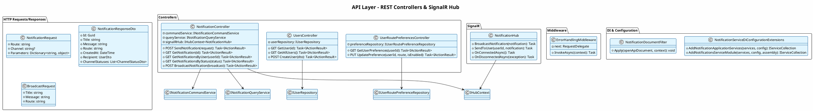

```plantuml
@startuml API Layer
!theme plain
skinparam backgroundColor #FEFEFE
skinparam classBackgroundColor #E1F5FE
skinparam classBorderColor #01579B

title API Layer - REST Controllers & SignalR Hub

package "Controllers" {
    class NotificationController {
        - commandService: INotificationCommandService
        - queryService: INotificationQueryService
        - signalRHub: IHubContext<NotificationHub>
        + POST SendNotification(request): Task<IActionResult>
        + GET GetNotification(id): Task<IActionResult>
        + GET GetNotificationsByUser(userId): Task<IActionResult>
        + GET GetNotificationsByStatus(status): Task<IActionResult>
        + POST BroadcastNotification(broadcast): Task<IActionResult>
    }

    class UsersController {
        - userRepository: IUserRepository
        + GET GetUser(id): Task<IActionResult>
        + GET GetAllUsers(): Task<IActionResult>
        + POST CreateUser(dto): Task<IActionResult>
    }

    class UserRoutePreferencesController {
        - preferenceRepository: IUserRoutePreferenceRepository
        + GET GetUserPreferences(userId): Task<IActionResult>
        + PUT UpdatePreference(userId, route, isEnabled): Task<IActionResult>
    }
}

package "SignalR" {
    class NotificationHub {
        + BroadcastNotification(notification): Task
        + SendToUser(userId, notification): Task
        + OnConnectedAsync(): Task
        + OnDisconnectedAsync(exception): Task
    }
}

package "Middleware" {
    class ErrorHandlingMiddleware {
        - next: RequestDelegate
        + InvokeAsync(context): Task
    }
}

package "DI & Configuration" {
    class NotificationServiceDiConfigurationExtensions {
        + AddNotificationApplicationServices(services, config): IServiceCollection
        + AddNotificationsServiceModule(services, config, assembly): IServiceCollection
    }

    class NotificationDocumentFilter {
        + Apply(openApiDocument, context): void
    }
}

package "HTTP Requests/Responses" {
    class NotificationRequest {
        + Route: string
        + Channel: string?
        + Parameters: Dictionary<string, object>
    }

    class NotificationResponseDto {
        + Id: Guid
        + Title: string
        + Message: string
        + Route: string
        + CreatedAt: DateTime
        + Recipient: UserDto
        + ChannelStatuses: List<ChannelStatusDto>
    }

    class BroadcastRequest {
        + Title: string
        + Message: string
        + Route: string
    }
}

NotificationController --> INotificationCommandService
NotificationController --> INotificationQueryService
NotificationController --> IHubContext
UsersController --> IUserRepository
UserRoutePreferencesController --> IUserRoutePreferenceRepository
NotificationHub --> IHubContext

@enduml
```