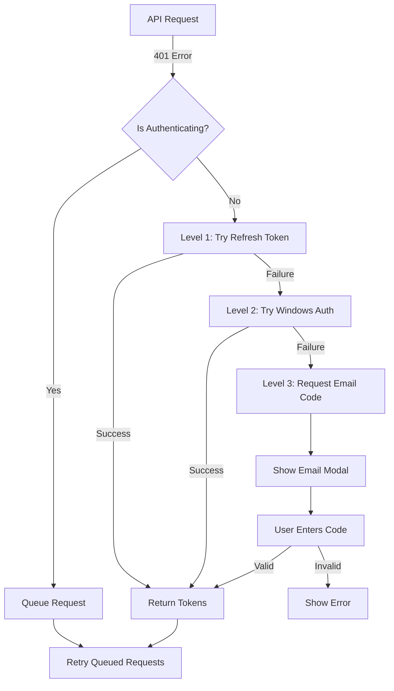

# Auto-Authentication System

Механизм автоматической аутентификации для MVP компонента уведомлений с трехуровневой стратегией fallback.

## ?? Основные возможности

- ? **Трехуровневая аутентификация** - автоматический fallback между методами
- ? **Прозрачная повторная аутентификация** - при 401 ошибке автоматически пытается восстановить сессию
- ? **Очередь запросов** - запросы во время аутентификации буферизуются и повторяются
- ? **React hooks** - простая интеграция в React приложения
- ? **TypeScript** - полная типизация
- ? **Email modal компонент** - готовый UI для ввода кода

## ?? Стратегия аутентификации

Система пытается аутентифицировать пользователя в следующем порядке:

### Level 1: Refresh Token
Пытается обновить access token используя сохраненный refresh token из localStorage.

```typescript
// Автоматически вызывается при 401 ошибке
const tokens = await authService.tryRefreshToken();
```

**Успех:** Новый access token получен, продолжаем работу  
**Неудача:** Переходим к Level 2

### Level 2: Windows Authentication
Пытается аутентифицироваться используя Windows credentials текущего пользователя.

```typescript
const tokens = await authService.tryWindowsAuthentication();
```

**Успех:** Получены новые токены, продолжаем работу  
**Неудача:** Переходим к Level 3

### Level 3: Email Code
Требует ввода verification code, отправленного на email пользователя.

```typescript
// Отправка кода
const challenge = await authService.sendEmailCode('user@example.com');

// Проверка кода
const tokens = await authService.verifyEmailCode({
  id: challenge.challengeId,
  code: '123456'
});
```

**Успех:** Получены новые токены  
**Неудача:** Пользователь должен повторить попытку

## ?? Использование

### Базовое использование с hooks

```typescript
import { useAuthentication } from '@notifications-service/inapp-component-mvp';

function App() {
  const { authState, authenticate, sendEmailCode, verifyEmailCode } = useAuthentication({
    apiBaseUrl: 'http://localhost:5093',
    autoAuthenticate: true, // Автоматическая аутентификация при монтировании
    onAuthSuccess: (tokens) => {
  console.log('Authentication successful!', tokens);
    },
    onAuthFailure: (error) => {
      console.error('Authentication failed:', error);
    },
    onEmailCodeRequired: (email, challengeId) => {
    // Показать modal для ввода email кода
    setShowEmailModal(true);
    }
  });

  return (
    <div>
      <p>Status: {authState.isAuthenticated ? 'Authenticated' : 'Not Authenticated'}</p>
      
      {authState.requiresEmailCode && (
        <EmailCodeForm onSubmit={(code) => {
          verifyEmailCode({
            id: authState.emailChallengeId!,
            code
    });
        }} />
      )}
  </div>
  );
}
```

### Интеграция с Notification Component

```typescript
import { useNotificationStore } from '@notifications-service/inapp-component-mvp';

function App() {
  const { store, authentication } = useNotificationStore({
    apiBaseUrl: 'http://localhost:5093',
    signalRHubUrl: 'http://localhost:5093/notificationHub',
    userId: 'user-id',
    onEmailCodeRequired: (email, challengeId) => {
      setShowEmailModal(true);
    }
  });

  // store - NotificationStore instance
  // authentication - useAuthentication return value
}
```

### Использование EmailCodeModal компонента

```typescript
import { EmailCodeModal } from '@notifications-service/inapp-component-mvp';

function App() {
  const [showModal, setShowModal] = useState(false);
  const { authentication } = useNotificationStore(config);

  return (
 <EmailCodeModal
  isOpen={showModal}
      challengeId={authentication.authState.emailChallengeId || ''}
      challengeMessage="Check your email for verification code"
      email="user@example.com"
      isVerifying={authentication.authState.isAuthenticating}
      error={authentication.authState.error}
      onVerify={async (verification) => {
    await authentication.verifyEmailCode(verification);
        setShowModal(false);
      }}
      onResendCode={async (email) => {
        await authentication.sendEmailCode(email);
      }}
      onClose={() => setShowModal(false)}
    />
  );
}
```

## ?? API Reference

### `useAuthentication(options)`

Hook для управления аутентификацией.

**Options:**
```typescript
{
  apiBaseUrl: string;        // Base URL для API
  autoAuthenticate?: boolean;   // Автоматическая аутентификация при mount (default: true)
  onAuthSuccess?: (tokens: AuthTokens) => void;
  onAuthFailure?: (error: string) => void;
  onEmailCodeRequired?: (email: string, challengeId: string) => void;
}
```

**Returns:**
```typescript
{
  authState: {
    isAuthenticated: boolean;
    isAuthenticating: boolean;
    error: string | null;
    emailChallengeId: string | null;
    emailChallengeMessage: string | null;
    requiresEmailCode: boolean;
  };
  authService: AuthenticationService;
  authenticate: () => Promise<AuthTokens | null>;
  sendEmailCode: (email: string) => Promise<EmailChallengeResponse>;
  verifyEmailCode: (verification: EmailCodeVerification) => Promise<AuthTokens>;
  logout: () => void;
  clearError: () => void;
}
```

### `AuthenticationService`

Низкоуровневый сервис аутентификации.

```typescript
const authService = new AuthenticationService({
  apiBaseUrl: 'http://localhost:5093',
  onAuthSuccess: (tokens) => { /* ... */ },
  onAuthFailure: (error) => { /* ... */ },
  onEmailCodeRequired: (email, challengeId) => { /* ... */ }
});

// Методы
await authService.authenticate();
await authService.sendEmailCode('user@example.com');
await authService.verifyEmailCode({ id: 'challenge-id', code: '123456' });
authService.logout();

// Управление токенами
const accessToken = authService.getAccessToken();
const refreshToken = authService.getRefreshToken();
authService.setTokens({ accessToken: '...', refreshToken: '...' });
authService.clearTokens();

// Проверка
const isAuth = authService.isAuthenticated();
```

### `NotificationApiClient`

API клиент с автоматической аутентификацией.

```typescript
const apiClient = new NotificationApiClient(
  'http://localhost:5093',
  accessToken,
  authService  // Опционально - для автоматической повторной аутентификации
);

// При 401 ошибке автоматически вызывает authService.authenticate()
const notifications = await apiClient.getNotifications();
```

## ?? Компоненты

### `EmailCodeModal`

Модальное окно для ввода email verification code.

**Props:**
```typescript
{
  isOpen: boolean;
  challengeId: string;
  challengeMessage?: string;
  email?: string;
  isVerifying: boolean;
  error?: string | null;
  onVerify: (verification: EmailCodeVerification) => Promise<void>;
  onResendCode: (email: string) => Promise<void>;
onClose: () => void;
}
```

**Features:**
- Автоформатирование 6-значного кода
- Валидация email
- Кнопка "Resend Code"
- Отображение ошибок
- Градиентный дизайн

## ?? Поток аутентификации



## ?? Хранение токенов

Токены хранятся в `localStorage`:

```typescript
localStorage.setItem('accessToken', token);
localStorage.setItem('refreshToken', token);
```

При logout или неудачной аутентификации токены очищаются:

```typescript
localStorage.removeItem('accessToken');
localStorage.removeItem('refreshToken');
```

## ??? Безопасность

- ? Токены хранятся в localStorage (не в cookies для избежания CSRF)
- ? Refresh tokens используются только на backend
- ? Windows authentication использует `withCredentials: true`
- ? Email verification codes имеют ограниченное время жизни
- ? Максимальное количество попыток ввода кода

## ?? Отладка

Все операции аутентификации логируются в консоль:

```
[Auth] Level 1: Attempting refresh token authentication...
[Auth] Level 1: ? Refresh token authentication successful

[Auth] Level 2: Attempting Windows authentication...
[Auth] Level 2: ? Windows authentication failed

[Auth] Level 3: Email code authentication required
[Auth] Email code sent: Check your mailbox...
```

## ?? Примеры

### Полный пример с React

См. файл `src/DemoApp.tsx` для полного рабочего примера с:
- Автоматической аутентификацией
- Email modal компонентом
- Интеграцией с notification component
- Индикаторами состояния
- Кнопками для тестирования

### Пример без React

```typescript
import { createAuthenticationService } from '@notifications-service/inapp-component-mvp';

const authService = createAuthenticationService({
  apiBaseUrl: 'http://localhost:5093',
  onEmailCodeRequired: async (email, challengeId) => {
    const code = prompt(`Enter code sent to ${email}:`);
    if (code) {
      await authService.verifyEmailCode({ id: challengeId, code });
    }
  }
});

// Автоматическая аутентификация
const tokens = await authService.authenticate();
```

## ?? Production готовность

Для production использования рекомендуется:

1. **Безопасное хранение refresh token** - рассмотрите HttpOnly cookies вместо localStorage
2. **Rate limiting** - ограничьте количество попыток аутентификации
3. **Error handling** - добавьте retry логику для network errors
4. **Monitoring** - логируйте failed authentication attempts
5. **Token rotation** - регулярно обновляйте refresh tokens

## ?? Дополнительно

- Backend API документация: `/docs/08-Authentication-Guide.md`
- Windows Authentication: `/docs/09-Windows-Authentication-Guide.md`
- JWT Claims Format: `/docs/10-JWT-Claims-Standard-Format.md`
